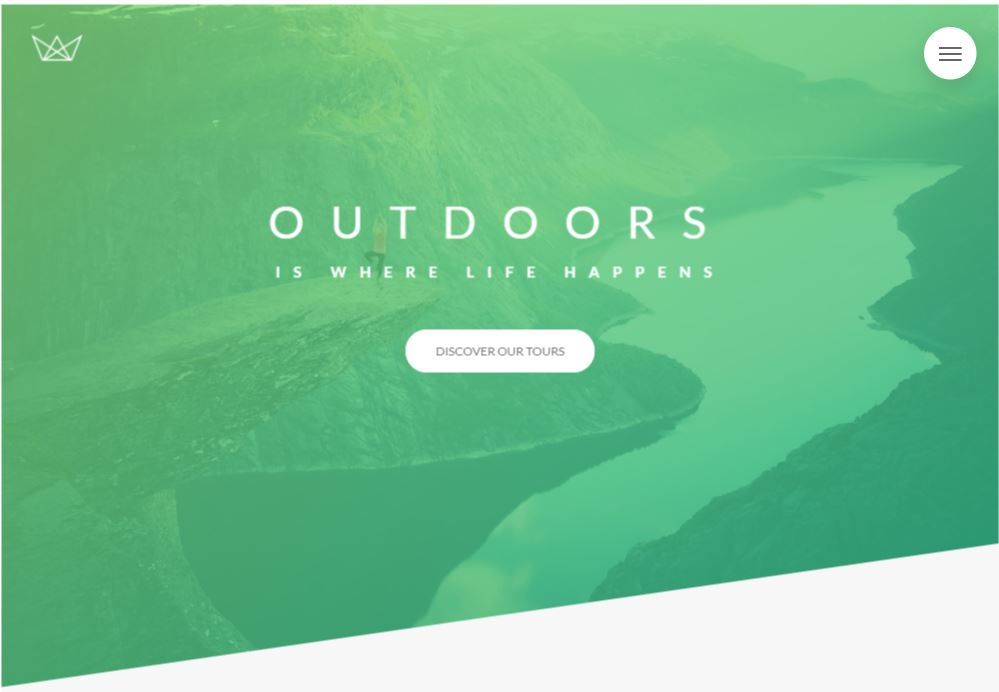
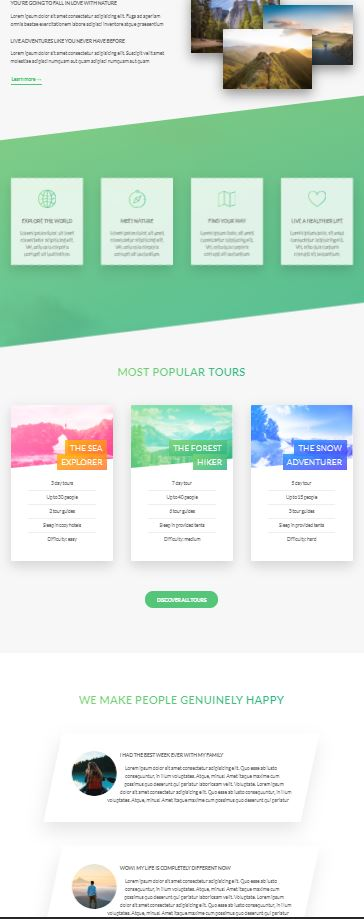

# projects-from-courses-by-jonas.io

## Table of contents
* [General info](#general-info)
* [Technologies Used](#technologies-used)
* [Screenshots](#screenshot)
* [Project Status](#project-status)
* [Acknowledgements](#acknowledgements)

## General info
This website focuses on css and sass. It was created while learning advanced css and sass.
	
## Technologies Used
Project is created with:
* CSS
* SASS / SCSS
* HTML5

## Screenshots

 ### Project Status
 Project is: Completed
 
 ### Acknowledgements
 This project was based on this [@tutorial](https://www.udemy.com/course/advanced-css-and-sass/)
 Projects from courses by [@Jonas Schmedtmann](http://jonas.io/)

